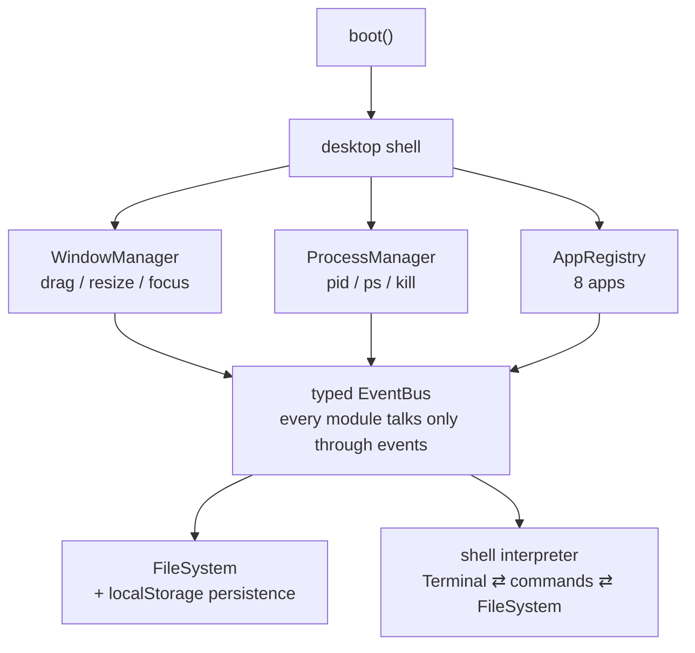

<div align="center">

[](https://www.npmjs.com/package/aurora-os)
[](https://github.com/BartoszOsiej/AURORA-OS/pkgs/container/aurora-os)
[](https://github.com/BartoszOsiej/AURORA-OS/releases)

[](LICENSE)

*A from-scratch desktop environment — window manager, virtual file system,
shell, and eight applications — entirely in TypeScript with **zero runtime
dependencies**. No frameworks, no bundler at runtime, no server.*

> *"Your browser is now your computer."*

</div>

## ✨ Features

| Layer | What you get |
|---|---|
| 🧠 **Kernel** | Animated boot sequence, typed EventBus, process table (PID lifecycle, `ps`/`kill`), settings subsystem, localStorage persistence |
| 🪟 **Window manager** | Drag, resize (8 handles), minimize / maximize / focus, cascading placement, glassmorphism chrome, open/close animations |
| 📂 **Virtual filesystem** | POSIX-inspired in-memory tree with `ls` / `cd` / `cat` / `mkdir -p` / `cp` / `mv` / `rm -r` / `grep` / `tree`, proper error codes (`ENOENT`, `EISDIR`, `EEXIST`, `EPERM`) |
| ⌨️ **Terminal** | Interactive shell with 35+ commands, history, Tab completion, output redirection (`>` and `>>`), ANSI colors, `neofetch`, `fortune`, `sudo` |
| 📱 **Apps** | Files, Terminal, Editor (Ctrl+S), Calculator, Paint (save PNG), System Monitor (live graphs), Settings, About |
| 🎨 **Theming** | 5 themes + 5 animated wallpapers |
| 🔊 **Audio** | Fully procedural WebAudio sound design — boot chime, UI clicks, window swooshes. No audio files. |

## 🚀 Quick start

```bash
npm install          # installs esbuild (dev-only build tool)
npm run build        # bundles to dist/
npm run serve        # http://localhost:8080
```

<details>
<summary><b>🖱️ First steps inside the OS</b></summary>

1. Double-click **Terminal** on the desktop (or use the Start menu ◈)
2. Type `help` to list all 35+ commands
3. `neofetch` for the system banner, `fortune` for wisdom
4. Create files: `echo hello > hello.txt`, then `cat hello.txt`
5. `open editor hello.txt` to edit graphically
6. Right-click the desktop: new folder, new file, wallpaper, lock screen
7. `ps` + `kill <pid>` to manage processes
8. Press **Ctrl+Alt+L** to lock the system

</details>

## 🧠 Architecture



**Design rules**

- **No direct imports between subsystems** — everything communicates over the typed `EventBus`, so each module is independently testable
- **Pure core, thin UI** — the shell interpreter, filesystem and event bus run without a DOM; the browser only renders
- **Zero runtime dependencies** — no React, no Redux, no bundler in the output

<details>
<summary><b>🗂️ Project structure & testing</b></summary>

```
aurora-os/
├── index.html              # Boot screen + desktop shell DOM
├── src/
│   ├── main.ts             # Kernel entry: boot, desktop, taskbar, lock screen
│   ├── core/               # EventBus, ProcessManager, WindowManager, AppRegistry
│   ├── fs/FileSystem.ts    # Virtual file system (paths, CRUD, persistence)
│   ├── term/               # commands.ts (35+ commands) + Terminal.ts (shell UI)
│   ├── apps/               # Terminal, Files, Editor, Calculator, Paint, Monitor…
│   └── sound/SoundSystem.ts # Procedural WebAudio effects
├── tests/run-tests.mjs     # Core-logic test harness (no DOM)
└── scripts/copy-assets.mjs
```

The core logic is DOM-free and unit-tested:

```bash
npm test        # EventBus, FileSystem, shell interpreter
npm run typecheck
```

</details>

---

<div align="center">

**Part of [BartoszOsiej](https://github.com/BartoszOsiej)'s portfolio** · [Live docs](https://bartoszosiej.github.io/Docs/projects/aurora-os/)

MIT © 2026 Bartosz Osiej

</div>
